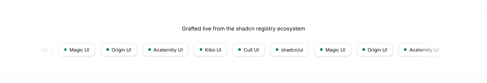
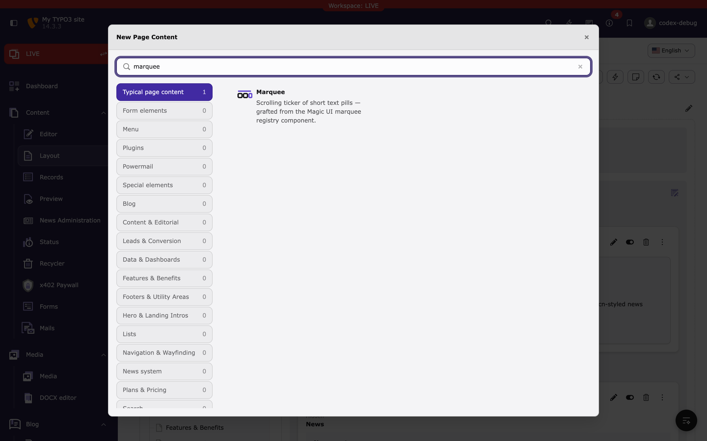
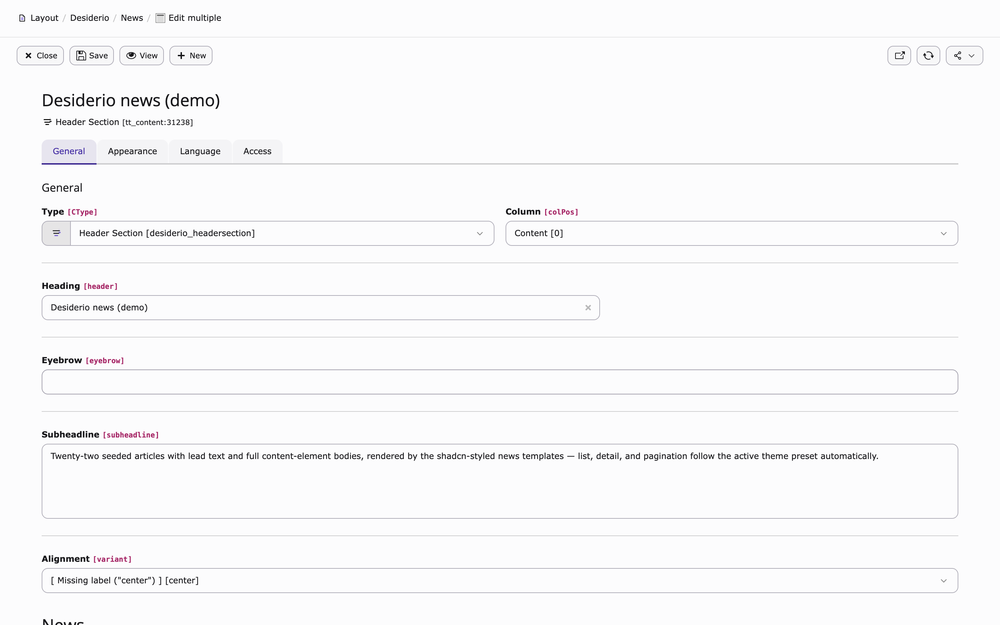
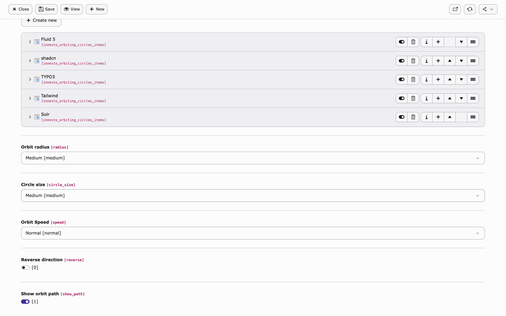
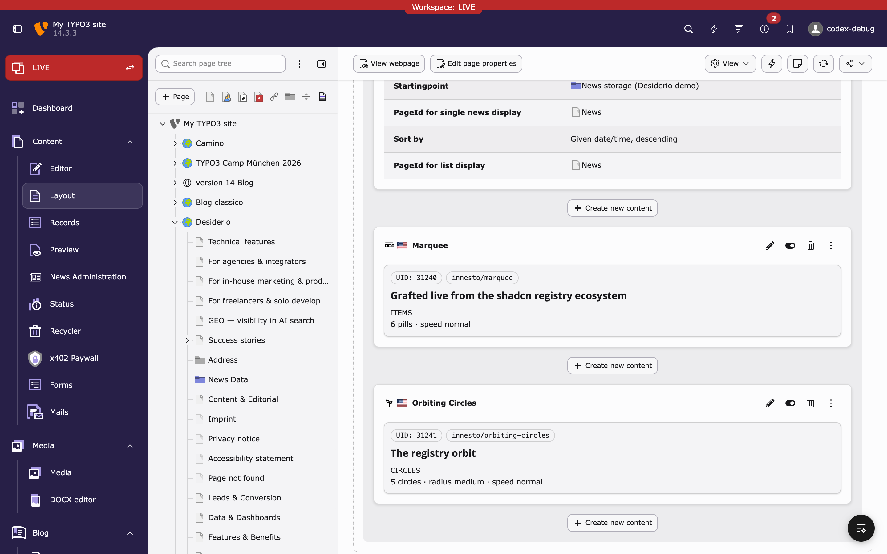

# Adding content elements from the shadcn registry

This is the complete, step-by-step manual for grafting a component from any
[shadcn/ui registry](https://registry.directory/) onto TYPO3 as a Desiderio
Content Blocks element. It walks through the exact graft that produced the
shipped `innesto/marquee` element — from picking the component to seeing it
scroll on the page:



Every command and screenshot in this manual was taken from a real TYPO3
v14.3 installation.

## How a graft works

Every registry on [registry.directory](https://registry.directory/) — shadcn/ui,
Magic UI, Origin UI, Aceternity UI, … — serves its components as JSON following
the same [`registry-item` schema](https://ui.shadcn.com/schema/registry-item.json):
React/TSX sources, plain CSS, and theme variables.

Innesto splits the conversion into two phases:

1. **The mechanical phase** (`innesto:add`, fully automatic): fetch the JSON,
   convert the CSS, scaffold a complete Content Blocks element folder, register
   the element in the site set, and write a tailored finishing prompt.
2. **The finishing phase** (you, or an AI agent via `--ai`): translate the React
   markup to Fluid, model the component props as editor fields, and port the
   styles onto the Desiderio design tokens. React components are programs, not
   documents — this phase cannot be mechanical, which is why it is clearly
   separated and prompt-assisted.

## Prerequisites

- A Composer-based TYPO3 v14.3 installation with
  [Desiderio](https://github.com/dirnbauer/desiderio) set up
- Innesto installed and added to your site's `config.yaml`
  (see the [README](../README.md#install))
- CLI access (`vendor/bin/typo3`); in ddev prefix commands with `ddev exec`
- Optional, for the AI finishing pass: the [`claude` CLI](https://claude.com/claude-code)

## Step 1 — Pick a component

Browse [registry.directory](https://registry.directory/) or a registry's own
site and note the item name. `innesto:add` accepts two forms:

| Form | Example |
| --- | --- |
| Shorthand `<registry>/<item>` for known registries | `magicui/marquee`, `shadcn/button`, `shadcnblocks/case-studies2`, `blocks/stats-01` |
| Full item-JSON URL for everything else | `https://magicui.design/r/globe.json` |

A leading `@` is accepted too, so the namespace form from the shadcn CLI docs
(`@shadcnblocks/case-studies2`) works verbatim.

The shorthand map currently knows `shadcn`, `magicui`, `shadcnblocks`, and
`blocks` (blocks.so)
([`RegistryClient`](../Classes/Registry/RegistryClient.php)). For any other
registry, pass the URL of the item JSON — it is usually linked as "Open in v0"
/ "registry item" on the component page, or simply `<registry>/r/<item>.json`.

> **Note (shadcn registry):** items of the official registry live under a
> style path — the shorthand resolves to
> `https://ui.shadcn.com/r/styles/new-york-v4/<item>.json` for you.

Good graft candidates are *documents with a little motion*: marquees, logo
clouds, bento grids, animated lists, badges. See
[What might not work](#what-converts-automatically--and-what-doesnt) before
picking something interaction-heavy.

## Step 2 — Run `innesto:add`

```bash
vendor/bin/typo3 innesto:add magicui/marquee
# in ddev:
ddev exec vendor/bin/typo3 innesto:add magicui/marquee
```

Real output:

```
Fetched "marquee" (registry:ui)
-------------------------------

 * marquee/sources/marquee.tsx
 * marquee/assets/frontend.css
 * marquee/assets/icon.svg
 * marquee/config.yaml
 * marquee/language/labels.xlf
 * marquee/templates/frontend.html

 [OK] Element "innesto/marquee" scaffolded.

 Registered "innesto/marquee" in the Innesto site set (Configuration/Sets/Innesto/config.yaml).
 AI finishing prompt written to marquee/AI_PROMPT.md
 Next steps (or rerun with --ai):
   1. Run the finishing pass: claude -p "$(cat AI_PROMPT.md)" --permission-mode acceptEdits
   2. Review the result, then: vendor/bin/typo3 extension:setup && cache:flush
```

Useful options:

| Option | Purpose |
| --- | --- |
| `--key globe` | Folder/element key if it should differ from the item name |
| `--target <dir>` | Scaffold into another extension's `ContentBlocks/ContentElements` (see [Grafting into your own sitepackage](#grafting-into-your-own-sitepackage)) |
| `--ai` | Run the finishing pass automatically via the `claude` CLI |

### What was generated

```
ContentBlocks/ContentElements/marquee/
├── AI_PROMPT.md                       # tailored prompt for the finishing pass
├── config.yaml                        # element definition — fields still TODO
├── templates/frontend.html            # Fluid stub with Desiderio wrappers
├── assets/frontend.css                # cssVars/keyframes already converted
├── assets/icon.svg                    # placeholder graft icon
├── language/labels.xlf                # title + description from the registry
└── sources/marquee.tsx                # upstream source, kept for provenance
```

Two parts are already real work done for you:

**`assets/frontend.css`** — the registry item's `css` and `cssVars` blocks are
converted to plain CSS. Tailwind `@theme` animation entries become custom
properties plus matching utility classes (the Desiderio Tailwind build does
not scan grafted elements, so the utilities must be emitted here):

```css
/* Grafted from registry item "marquee" (Marquee). Tokens map onto the Desiderio shadcn variables. */
:root {
    --animate-marquee: marquee var(--duration) infinite linear;
}
.animate-marquee {
    animation: var(--animate-marquee);
}
@keyframes marquee {
    from { transform: translateX(0); }
    to { transform: translateX(calc(-100% - var(--gap))); }
}
```

**The site-set registration** — Content Blocks exposes every content block as
a virtual site set named after the block (`innesto/marquee`). Desiderio
references all of its elements that way, which switches the New Content
Element wizard into allow-list mode per site: any block *not* listed in a site
set is hidden from editors. `innesto:add` therefore appends the new block to
`Configuration/Sets/Innesto/config.yaml`:

```yaml
optionalDependencies:
  - innesto/marquee
```

Without this line the element would render fine but never appear in the
wizard — the number one "why can't I add my element?" trap.

## Step 3 — The finishing pass

The scaffolded `templates/frontend.html` is a stub; `config.yaml` has only the
`header` field. The finishing pass turns the preserved React source into a
proper editor-facing element. You have two options.

### Option A: let an agent do it

```bash
vendor/bin/typo3 innesto:add magicui/marquee --ai
```

This runs the `claude` CLI with the generated `AI_PROMPT.md` in the element
directory. The prompt contains the upstream sources and all Desiderio
conventions, so the pass is reproducible with any agent:

```bash
cd ContentBlocks/ContentElements/marquee
claude -p "$(cat AI_PROMPT.md)" --permission-mode acceptEdits
```

> In ddev the `claude` binary usually lives on the host, not in the web
> container — run `innesto:add` inside ddev and the finishing pass from the
> host, or set `INNESTO_CLAUDE_BIN`.

Review the result like any contribution: check the rendered output, the
backend form, and that the CSS only uses semantic tokens.

### Option B: do it yourself

Work through the three files. The shipped marquee shows each step.

**1. Model the props as fields in `config.yaml`.** Look at the props interface
in `sources/marquee.tsx` (`reverse`, `pauseOnHover`, `repeat`, children) and
translate them to Content Blocks fields:

```yaml
fields:
  -
    identifier: header
    useExistingField: true
    label: 'Heading'
  -
    identifier: marquee_items          # the React children become a Collection
    type: Collection
    table: innesto_marquee_items
    prefixField: true
    label: 'Items'
    minItems: 3
    fields:
      -
        identifier: title              # NEVER name a child field "label" — reserved!
        type: Textarea
        rows: 1
        label: 'Item text'
        required: true
  -
    identifier: speed                  # enum prop → Select
    type: Select
    renderType: selectSingle
    label: 'Scroll Speed'
    items:
      - { label: 'Slow', value: slow }
      - { label: 'Normal', value: normal }
      - { label: 'Fast', value: fast }
    default: normal
  -
    identifier: reverse                # boolean prop → Checkbox toggle
    type: Checkbox
    renderType: checkboxToggle
    label: 'Reverse direction'
    default: 0
  -
    identifier: pause_on_hover
    type: Checkbox
    renderType: checkboxToggle
    label: 'Pause on hover'
    default: 1
```

Conventions: Select for enums, Checkbox `checkboxToggle` for booleans,
Textarea `rows: 1` for short text, Collection for repeatable children. A
Collection child must never be called `label` — that identifier is reserved by
Content Blocks and breaks the generated table.

**2. Translate the markup in `templates/frontend.html`.** Keep the generated
`d:layout.section` / `d:layout.container` wrapper and the `f:asset.css` line.
Editor content comes from `{data.<field>}`; the repeat-for-seamless-loop trick
from the React component becomes a plain `f:for`:

```xml
<div
    class="innesto-marquee innesto-marquee--{data.speed -> f:or(alternative: 'normal')}{f:if(condition: data.reverse, then: ' innesto-marquee--reverse')}{f:if(condition: data.pause_on_hover, then: ' innesto-marquee--pause')}"
    role="group"
    aria-label="{data.header -> f:or(alternative: 'Marquee')}"
>
    <ul class="innesto-marquee__group">
        <f:for each="{data.marquee_items}" as="entry">
            <li class="innesto-marquee__pill">{entry.title}</li>
        </f:for>
    </ul>
    <f:for each="{0: 1, 1: 2, 2: 3}" as="copy">
        <ul class="innesto-marquee__group" aria-hidden="true">
            <f:for each="{data.marquee_items}" as="entry">
                <li class="innesto-marquee__pill">{entry.title}</li>
            </f:for>
        </ul>
    </f:for>
</div>
```

State-free interactivity (hover, direction, speed) becomes CSS modifier
classes. Real state (toggles, tabs) goes to Alpine.js `x-data` attributes —
no inline `<script>`.

**3. Port the styles in `assets/frontend.css`.** Use only the semantic theme
tokens — never hard-coded colors — and the element follows every Desiderio
preset automatically, including dark mode:

```css
.innesto-marquee__pill {
    border: 1px solid var(--border);
    border-radius: calc(var(--radius, 0.625rem) + 4px);
    background: var(--card);
    color: var(--card-foreground);
    box-shadow: var(--shadow-sm);
}
@media (prefers-reduced-motion: reduce) {
    .innesto-marquee__group { animation-play-state: paused; }
}
```

Prefix every class with `.innesto-<key>`, and honor
`prefers-reduced-motion` for anything that moves.

**4. Optional but recommended:** a `templates/backend-preview.fluid.html`
modeled on the Desiderio previews gives editors a real preview card in the
page module (visible in the screenshot below).

## Step 4 — Activate the element

```bash
vendor/bin/typo3 extension:setup    # creates the new database tables
vendor/bin/typo3 cache:flush
```

`extension:setup` is required whenever `config.yaml` gains fields backed by
new columns or Collection tables.

## Step 5 — Use it in the backend

The element now appears in the **New Content Element wizard** under
"Typical page content", with the icon, title, and description taken from the
registry item:



The edit form shows the fields exactly as modeled, with the element type
resolved from the registry item's title:



Scrolling down: the Items collection, scroll speed select, and the two
toggles:



And the page module renders the backend preview (here next to a second graft,
`innesto/orbiting-circles`, finished entirely by the `--ai` pass):



## Step 6 — Check the frontend

Open the page. The marquee scrolls, pauses on hover, masks its edges, and uses
the active theme preset's card, border, and primary tokens — switch the
Desiderio preset in the site settings and the graft repaints with it:


## Worked example 2: a shadcnblocks block (`innesto/case-studies`)

The marquee above is *motion with little structure*. The shipped
`innesto/case-studies` element is the opposite — a structured, document-shaped
block — and shows the patterns that kind of graft needs. It was produced from
[`case-studies2` on shadcnblocks.com](https://www.shadcnblocks.com/block/case-studies2):
customer quotes with portrait, role, company logo, and per-study metrics.

### Fetch and rename

```bash
vendor/bin/typo3 innesto:add @shadcnblocks/case-studies2 --key case-studies
```

Two things to note:

- `shadcnblocks` is a known shorthand, and a leading `@` is accepted, so the
  namespace form used in the shadcn CLI docs works verbatim.
- Registries ship numbered variants (`case-studies1`, `case-studies2`, …).
  `--key` drops the digit so the element key, CSS prefix, and editor-facing
  name stay clean (`innesto/case-studies`, `.innesto-case-studies`). The
  upstream name is preserved in `sources/case-studies2.tsx` for provenance.

The command warns about `registryDependencies: utils, separator` — both are
intentionally *not* resolved: `cn()` is a React-only class helper, and the
`<Separator>` component becomes a plain `<hr>` with a `border-top` in the
finishing pass. Most `registryDependencies` of presentational blocks dissolve
like this; fetch a dependency only when it carries actual content.

### The finishing pass for structured blocks

The React source repeats a "study" twice with hard-coded demo content. The
finishing pass turns that repetition into editor data:

| Upstream pattern | Content Blocks modeling |
| --- | --- |
| Repeated `<div className="grid …">` study blocks | `Collection` field (`case_studies_items`, `table: innesto_case_studies_items`) |
| The two metric `<div>`s inside each study | **nested** `Collection` (`metrics`, `table: innesto_case_studies_metrics`) |
| `` portrait / company logo | `File` fields (`allowed: common-image-types`, `maxitems: 1`) |
| Hard-coded strings (quote, name, role, "98%") | `Textarea` fields, `rows: 1` for short text |
| `<Separator className="my-20" />` between studies | `<f:if condition="!{iterator.isFirst}"><hr …/></f:if>` |
| `4500+ Satisfied Customers` eyebrow line | plain `eyebrow` field — same shape Desiderio already uses, so the column is shared |

Nested Collections are the one thing to be careful with: give **every**
`Collection` an explicit `table:` key (`innesto_case_studies_items`,
`innesto_case_studies_metrics`). Without it, Content Blocks derives the table
name from the bare identifier, and generic identifiers like `metrics` or
`items` silently share one table with any other element that picks the same
name. And never name a child field `label` — reserved, use `title`.

### Activate and seed

```bash
vendor/bin/typo3 extension:setup    # creates both collection tables
vendor/bin/typo3 cache:flush
```

In the edit form the studies are an IRRE collection with the metrics nested
one level deeper; the frontend renders the 2:1 bordered split from the
upstream design, restyled entirely through the semantic tokens — no value in
[`assets/frontend.css`](../ContentBlocks/ContentElements/case-studies/assets/frontend.css)
is a raw color.

## Grafting into your own sitepackage

By default elements land in `EXT:innesto/ContentBlocks/ContentElements`. To
graft into your own extension instead:

```bash
vendor/bin/typo3 innesto:add magicui/marquee \
  --target /var/www/html/packages/my_sitepackage/ContentBlocks/ContentElements
```

With `--target`, Innesto cannot know your site set, so register the block
yourself — add the block name to your set's config
(`Configuration/Sets/<YourSet>/config.yaml`):

```yaml
optionalDependencies:
  - innesto/marquee
```

Skipping this hides the element from the New Content Element wizard on every
site that restricts content blocks per set (any Desiderio site does).

## What converts automatically — and what doesn't

| Registry item part | Conversion |
| --- | --- |
| `cssVars` (theme/light/dark tokens) | ✅ automatic — Desiderio uses the same shadcn variable names, 1:1 |
| `css` (keyframes, rules) | ✅ automatic — serialized into `assets/frontend.css` |
| Tailwind `@theme` animation entries | ✅ automatic — custom property + matching utility class |
| Registry `categories` → wizard group | ✅ automatic — the item's first category becomes the Content Blocks `group`; the blocks.so categories ship pre-registered as wizard groups ([`Configuration/TCA/Overrides/tt_content.php`](../Configuration/TCA/Overrides/tt_content.php)) |
| Site-set registration | ✅ automatic (default target) |
| React/TSX markup | ⚠️ finishing pass — structural markup translates quickly; hooks/state need Alpine.js or CSS |
| Component props | ⚠️ finishing pass — modeled as Content Blocks fields |
| npm `dependencies` / `registryDependencies` | ❌ not fetched — the command lists them as a warning; resolve manually |

Components that are mostly *state machines* — command palettes, comboboxes,
drag-and-drop, anything built on Radix primitives with heavy keyboard
interaction — do not graft well. The scaffold still works, but the finishing
pass would mean reimplementing the component. Pick presentational components.

## Troubleshooting

**The element does not appear in the New Content Element wizard.**
The block is not registered as a site-set dependency (see Step 2), or caches
are stale. Check `Configuration/Sets/Innesto/config.yaml` lists
`innesto/<key>` under `optionalDependencies`, then `cache:flush`. The same
mechanism also filters the *Type* dropdown in existing records.

**`Element directory already exists`.**
`innesto:add` never overwrites. Delete the folder or pass a different `--key`.

**The frontend renders unstyled.**
The per-element CSS is loaded by the `f:asset.css` line in
`templates/frontend.html` — keep it. After renaming the key, the
`{cb:assetPath()}` reference and class prefixes must match the new folder name.

**`SQL error` / fields missing after editing `config.yaml`.**
Run `vendor/bin/typo3 extension:setup` to create new columns/tables, then
`cache:flush`.

**`claude CLI not found` when using `--ai` inside ddev.**
The binary lives on the host. Run the finishing pass from the host in the
element directory, or point `INNESTO_CLAUDE_BIN` at a binary available inside
the container.

**A Collection child field named `label` breaks the backend.**
`label` is reserved by Content Blocks for the generated table — rename the
field (e.g. `title`).

**Registry item URL returns 404 for the official shadcn registry.**
Items live under a style path: `https://ui.shadcn.com/r/styles/new-york-v4/<item>.json`.
The `shadcn/<item>` shorthand handles this for you.
