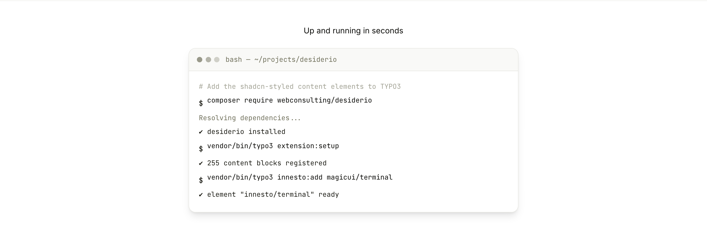

# Terminal (`innesto/terminal`)

An animated terminal that types out commands and reveals their output line by
line — grafted from the
[Magic UI terminal](https://magicui.design/docs/components/terminal) registry
component.

## What it does

The upstream component drives its typewriter and sequential reveal with
`motion/react`. The finishing pass re-created that motion in **pure CSS**, so the
element ships **zero JavaScript**: each line carries an inline `--index` and the
reveal/typing animations are staggered off it (the same trick the
`orbiting-circles` graft uses). It honours `prefers-reduced-motion` and an
editor "Animate" toggle.

## Editor fields

| Field | Type | Purpose |
| --- | --- | --- |
| `header` | shared heading | Optional section heading above the window |
| `terminal_title` | Text | Window title bar label (e.g. a path) |
| `terminal_lines` | Collection (`innesto_terminal_lines`) | The lines |
| └ `kind` | Select | `command` · `output` · `success` · `muted` |
| └ `text` | Textarea | The line text |
| `speed` | Select | Typing speed: slow · normal · fast |
| `animate` | Checkbox | Typewriter + reveal on/off |

`command` lines get a `$` prompt and type out character by character; the others
fade in. Colours — including the window dots — come entirely from the Desiderio
semantic tokens via `color-mix`, so the element follows every preset and dark
mode.

> **One CSS gotcha worth remembering:** the typewriter uses
> `clip-path … steps(N, jump-none)`, not `steps(N, end)`. With `end` the final
> keyframe is never held, so a long line stops one character short.

## Adding your own graft

This element was produced with the standard Innesto graft workflow
(`innesto:add magicui/terminal` → finishing pass → `extension:setup`). For the
**complete, screenshot-by-screenshot manual** — picking a component, modelling
fields, translating to Fluid, porting styles onto tokens, and the backend/
frontend walkthrough — see the Desiderio documentation:

📖 **[Adding content elements from a shadcn block](https://github.com/dirnbauer/desiderio/blob/main/Documentation/Developer/AddingContentElements.rst)**

The [CLI/command reference](../AddingContentElements.md) in this repo covers the
`innesto:add` options and two more worked examples.
